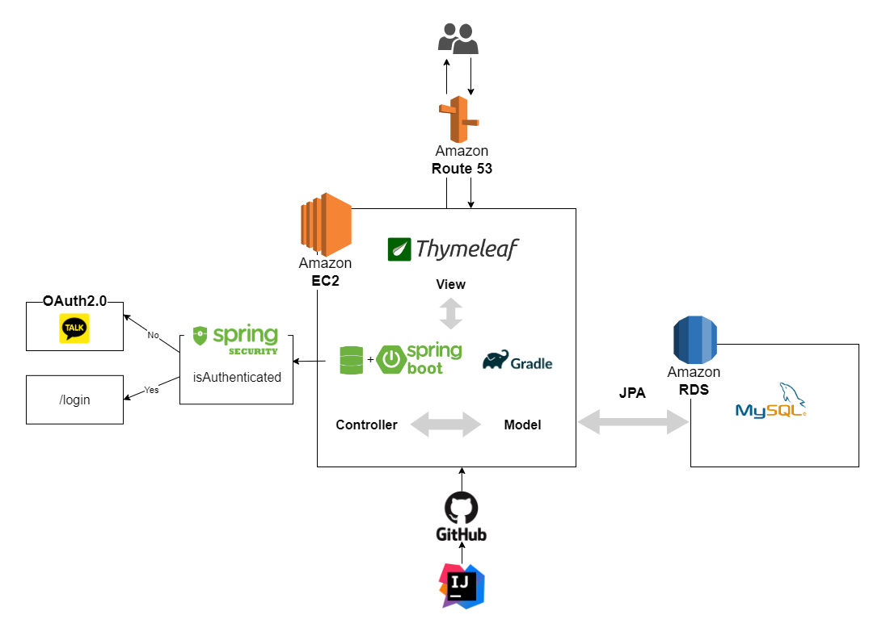

# 🐈 Petsitter
반려동물 돌봄 예약 서비스  
주소를 기반으로 원하는 펫시터의 날짜와 시간을 예약해 펫시팅을 이용할수 있습니다.
  
- 개발 기간 : 2024.06.07 ~ 2024.07.06
- **프로젝트 블로그** [(바로가기)](https://jjuya.tistory.com/category/%ED%94%84%EB%A1%9C%EC%A0%9D%ED%8A%B8/Springboot-Petsitter)
- 프로젝트 서비스 [(바로가기)](http://petsitterbooking.store/)  
  📌테스트 계정  -  test@gmail.com / 12345678
 

## 목차
- [🛠️프로젝트 아키텍처](#️프로젝트-아키텍처)
- [🚀사용기술](#사용기술)
- [💻주요기능](#주요기능)
- [📈트러블슈팅](#트러블슈팅) 
- [📌버전](#버전)
 

## 🛠️프로젝트 아키텍처
### 서비스 아키텍처

AWS EC2와 RDS를 통한 확장성, Spring Security와 OAuth 2.0으로 강화된 보안, Spring Boot와 JPA로 간소화된 유지 보수성을 제공하는 클라우드 기반 아키텍처 설계

### ERD

  

## 🚀사용기술
### IDE
  

### 언어 / 프레임워크
    

### 인증/인가
  

### 데이터베이스
  

### 라이브러리
 

### AWS
   

 

## 💻주요기능
| 권한 | 기능     | 설명     |
|:------------- | :------------- | :------------- |
|비회원|회원 관리 서비스|이메일을 통해 로그인할 수 있으며, 회원가입 시 이메일을 중복 검사합니다. 로그인 작업 후에 모든 서비스 이용 가능합니다. 회원정보 페이지에서 정보 수정 가능하며, 회원 권한(Role)을 변경하여 펫시터 모드로도 사용할 수 있습니다.|
|비회원|OAuth 로그인|Kakao API를 통해 로그인을 할 수 있습니다. 회원 사진, 닉네임, 이메일을 받아와 회원 가입/로그인을 진행합니다.  주소 전화번호는 회원정보 페이지에서 수정 가능합니다.|
|회원|지역별 펫시터터  목록 조회|등록된 펫시터 정보를 제공합니다. 원하는 지역에서 활동하는 펫시터를 검색을 통해 찾을 수 있습니다. 펫시터 모드에서만 등록/수정/삭제 가능합니다.|
|회원|펫시터 상세페이지|펫시터를 등록한 멤버의 이미지와 펫시터 정보를 제공합니다. 등록 지역 1000m 반경 kakao API를 통해 시각적으로 확인 가능합니다.  돌봄 이미지를 슬라이드로 확인 가능합니다.|
|회원|예약 서비스|선택한 펫시터에 해당하는 날짜를 검색해서 예약되지 않은 시간대를 예약할 수 있습니다. '확정', '대기'인 펫시터 상품에 해당하는 예약시간대는 선택할 수 없습니다. 반려동물이 등록이 되어있어야 예약 가능합니다.|
|회원|나의 예약 서비스 확인|내가 예약한 서비스를 확인할 수 있습니다. 예약 취소는 '대기' 상태일 때만 가능합니다.|
|회원|나의 반려동물 등록|나의 반려동물을 등록, 조회, 수정, 삭제 가능합니다. 등록된 반려동물 이미지를 확인할 수 있습니다.|
|회원|찜 기능|내가 찜한 상품을 한눈에 확인할 수 있습니다.  찜 등록, 삭제 가능 펫시터 상품이 삭제되면 해당 찜도 함께 삭제됩니다.|
|회원 펫시터모드|나의 펫시터 관리|내가 등록한 펫시터 서비스를 확인할 수 있습니다. 수정, 삭제 가능합니다.  펫시터 서비스 삭제 시 해당 펫시터 상품의 예약 전부 '취소' 처리됩니다.|
|회원 펫시터모드|나의 펫시터 예약현황|내가 등록한 펫시터 서비스의 예약 현황을 확인할 수 있습니다. '대기','확정','취소' 상태 관리할 수 있습니다. '대기' 상태에서만 상태 변경이 가능합니다.|
|회원|문의 게시판|게시판 글을 등록, 수정, 삭제, 조회할 수 있습니다. 게시글에 댓글을 달 수 있습니다.|
 

## 📈트러블슈팅
### **자주 조회 되는 데이터 성능 최적화**  
- 특정 멤버의 예약을 조회 시, [펫시터 지역 조회시 @Index 어노테이션](https://jjuya.tistory.com/96)을 사용하여 성능 개선
- @ManyToOne(fetch = FetchType.LAZY)을 이용하여 리스트 조회 시 조회 속도 향상
- 연관 데이터 조회 시 Fetch Join을 이용하여 N+1 문제 해결
- 날짜 클릭할때 마다 조회되는 예약시간 데이터 @Cacheable사용
- 펫시터 상품, 예약리스트 조회 등 대용량 데이터 조회시 페이지 네이션으로 부하 감소 및 응답 속도 향상  

### **이미지 용량 감소로 로딩 속도 개선**  
- thumbnailator 라이브러리로 이미지 용량 감소
- application.properties 이미지 용량 제한 15mb 제한 설정  
 
### **회원 권한 부여**  
- 펫시터 회원권한 부여 시 기본 사용자에게는 보이지 않는 펫시터 상품 등록, 예약 상품 리스트 상태 관리 **기능**과 내가 등록한 펫시터 상품 확인, 예약된 상품 확인 **정보 제공**

### **코드 재 사용성, 확장성 향상**  
- Utill 클래스를 사용해서 코드 재 사용성, 확장성 향상
 

## 📌버전

### v8.8.5
- [수정] 코드 리팩토링
- [수정] petsitter 삭제 기능 수정 - delflag 상태 변경으로 수정
- [수정] 펫시터 상세 페이지 kakao api 지도 추가

### v8.8.4
- [추가] 예약check 페이지(/reservation/check)
- [추가] wish 등록(/wish/)
- [추가] wish 조회(/wish/exists)
- [추가] wish 삭제(/wish/delete/{id})
- [수정] 예약현황 페이지 상태 수정

### v7.7.3
- [추가] 나의 예약현황(/mypage/myPetsitterResList)
- [추가] 나의 펫시터예약현황(/mypage/myPetsitterItemResList)
- [추가] 예약페이지 주소만 추가/수정 작업(/addAddress)

### v7.6.3
- [추가] board 등록(/board/)
- [추가] board 조회(/board/list)
- [추가] board 수정(/board/update/{id})
- [추가] board 상세페이지 조회(/board/{id})
- [추가] board 삭제(/board/delete/{id})
- [추가] comment 등록(/comment/)
- [추가] comment 수정(/update/{id}/comments/{commentId})
- [추가] comment 조회(/getComment/{id})
- [추가] comment 조회(/getComment/{id})

### v6.6.3
- [추가] reservation 등록(/reservation/)
- [추가] reservation 총가격 조회(/reservation/getTotalPriceByTime)

### v6.5.3
- [추가] reservation 시간 조회 (/reservation/getReservationTimes)
- [추가] reservation 페이지 (/reservation/{id})

### v5.5.3
- [추가] petsitter 삭제(/petsitter/delete/{id})

### v5.5.3
- [추가] petsitter 수정(/petsitter/update/{id})
- [추가] error 페이지(/error)
- [수정] member 이미지 추가
- [수정] petsitter 조회 정렬 - 오름차순 정렬
- [수정] petsitter 등록시 날짜 null 수정

### v5.4.2
- [추가] petsitter 등록(/petsitter/)
- [추가] petsitter 조회(/petsitter/list)
- [추가] petsitter 상세페이지 조회(/petsitter/{id})
- [추가] 회원정보 Role 변경 기능 추가

### v4.3.2
- [추가] pet 파일 업로드작업
- [수정] 삭제 오류 수정

### v4.2.1
- [추가] pet 수정(/pet/update/{id})
- [추가] pet 조회(/pet/delete/{id})
- [추가] pet 상세페이지 조회(/pet/{id})

### v4.1.1
- [추가] pet 등록(/pet/)
- [추가] pet 조회(/pet/list)

### v3.1.1
- [추가] 마이페이지(/my/mypage)
- [추가] 회원수정(/update)
- [수정] 로그인 기능 오류 수정

### v2.0.0
- [추가] 카카오 로그인(/api/kakao/callback)
- [추가] 카카오 로그아웃(/api/kakao/logout)

### v1.0.0
- [추가] 메인페이지(/)
- [추가] 로그인(/login)
- [추가] 회원가입(/join)
- [추가] 아이디체크(/idcheck)

 

## 향후 업데이트 예정
OAuth 로그인 - 네이버, 구글 
관리자 버전 업그레이드
