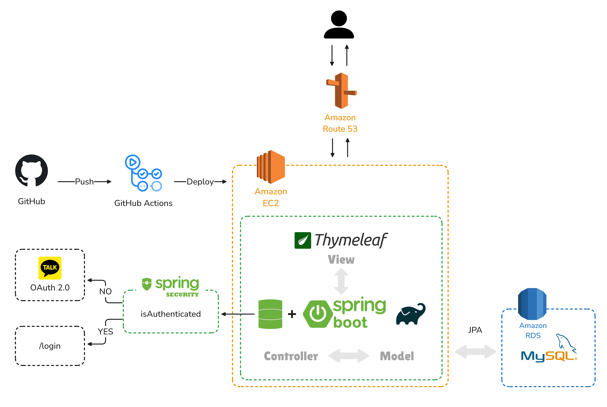

# 🐈 Petsitter
반려동물 돌봄 예약 서비스 입니다! 
주소를 기반으로 원하는 펫시터의 날짜와 시간을 예약해 펫시팅을 이용할수 있습니다.
  

## 개발환경
- IDE: IntelliJ IDEA Community
- Java: JDK 17
- Spring Boot ： 3.3.0
- Gradle: 7.3.2
- 데이터베이스: MySQL
- 외부 서비스/API: Kakao API(OAuth 2.0)
- 보안 프레임워크: Spring Security
- 프레임워크 및 라이브러리: Lombok, Spring Web, Spring Data JPA, Thymeleaf
- AWS : EC2, RDS, Route 53
 

## 아키텍처

 

## ERD

 

## 주요기능
| 권한 | 기능     | 설명     |
|:------------- | :------------- | :------------- |
|비회원|회원 관리 서비스|이메일을 통해 로그인할 수 있으며, 회원가입 시 이메일을 중복 검사합니다. 로그인 작업 후에 모든 서비스 이용 가능합니다. 회원정보 페이지에서 정보 수정 가능하며, 회원 권한(Role)을 변경하여 펫시터 모드로도 사용할 수 있습니다.|
|비회원|OAuth 로그인|Kakao API를 통해 로그인을 할 수 있습니다. 회원 사진, 닉네임, 이메일을 받아와 회원 가입/로그인을 진행합니다.  주소 전화번호는 회원정보 페이지에서 수정 가능합니다.|
|회원|지역별 펫시터터  목록 조회|등록된 펫시터 정보를 제공합니다. 원하는 지역에서 활동하는 펫시터를 검색을 통해 찾을 수 있습니다. 펫시터 모드에서만 등록/수정/삭제 가능합니다.|
|회원|펫시터 상세페이지|펫시터를 등록한 멤버의 이미지와 펫시터 정보를 제공합니다. 등록 지역 1000m 반경 kakao API를 통해 시각적으로 확인 가능합니다.  돌봄 이미지를 슬라이드로 확인 가능합니다.|
|회원|예약 서비스|선택한 펫시터에 해당하는 날짜를 검색해서 예약되지 않은 시간대를 예약할 수 있습니다. '확정', '대기'인 펫시터 상품에 해당하는 예약시간대는 선택할 수 없습니다. 반려동물이 등록이 되어있어야 예약 가능합니다.|
|회원|나의 예약 서비스 확인|내가 예약한 서비스를 확인할 수 있습니다. 예약 취소는 '대기' 상태일 때만 가능합니다.|
|회원|나의 반려동물 등록|나의 반려동물을 등록, 조회, 수정, 삭제 가능합니다. 등록된 반려동물 이미지를 확인할 수 있습니다.|
|회원|찜 기능|내가 찜한 상품을 한눈에 확인할 수 있습니다.  찜 등록, 삭제 가능 펫시터 상품이 삭제되면 해당 찜도 함께 삭제됩니다.|
|회원 펫시터모드|나의 펫시터 관리|내가 등록한 펫시터 서비스를 확인할 수 있습니다. 수정, 삭제 가능합니다.  펫시터 서비스 삭제 시 해당 펫시터 상품의 예약 전부 '취소' 처리됩니다.|
|회원 펫시터모드|나의 펫시터 예약현황|내가 등록한 펫시터 서비스의 예약 현황을 확인할 수 있습니다. '대기','확정','취소' 상태 관리할 수 있습니다. '대기' 상태에서만 상태 변경이 가능합니다.|
|회원|문의 게시판|게시판 글을 등록, 수정, 삭제, 조회할 수 있습니다. 게시글에 댓글을 달 수 있습니다.|
 

## 버전

### v8.8.5
- [수정] 코드 리팩토링
- [수정] petsitter 삭제 기능 수정 - delflag 상태 변경으로 수정
- [수정] 펫시터 상세 페이지 kakao api 지도 추가

### v8.8.4
- [추가] 예약check 페이지(/reservation/check)
- [추가] wish 등록(/wish/)
- [추가] wish 조회(/wish/exists)
- [추가] wish 삭제(/wish/delete/{id})
- [수정] 예약현황 페이지 상태 수정

### v7.7.3
- [추가] 나의 예약현황(/mypage/myPetsitterResList)
- [추가] 나의 펫시터예약현황(/mypage/myPetsitterItemResList)
- [추가] 예약페이지 주소만 추가/수정 작업(/addAddress)

### v7.6.3
- [추가] board 등록(/board/)
- [추가] board 조회(/board/list)
- [추가] board 수정(/board/update/{id})
- [추가] board 상세페이지 조회(/board/{id})
- [추가] board 삭제(/board/delete/{id})
- [추가] comment 등록(/comment/)
- [추가] comment 수정(/update/{id}/comments/{commentId})
- [추가] comment 조회(/getComment/{id})
- [추가] comment 조회(/getComment/{id})

### v6.6.3
- [추가] reservation 등록(/reservation/)
- [추가] reservation 총가격 조회(/reservation/getTotalPriceByTime)

### v6.5.3
- [추가] reservation 시간 조회 (/reservation/getReservationTimes)
- [추가] reservation 페이지 (/reservation/{id})

### v5.5.3
- [추가] petsitter 삭제(/petsitter/delete/{id})

### v5.5.3
- [추가] petsitter 수정(/petsitter/update/{id})
- [추가] error 페이지(/error)
- [수정] member 이미지 추가
- [수정] petsitter 조회 정렬 - 오름차순 정렬
- [수정] petsitter 등록시 날짜 null 수정

### v5.4.2
- [추가] petsitter 등록(/petsitter/)
- [추가] petsitter 조회(/petsitter/list)
- [추가] petsitter 상세페이지 조회(/petsitter/{id})
- [추가] 회원정보 Role 변경 기능 추가

### v4.3.2
- [추가] pet 파일 업로드작업
- [수정] 삭제 오류 수정

### v4.2.1
- [추가] pet 수정(/pet/update/{id})
- [추가] pet 조회(/pet/delete/{id})
- [추가] pet 상세페이지 조회(/pet/{id})

### v4.1.1
- [추가] pet 등록(/pet/)
- [추가] pet 조회(/pet/list)

### v3.1.1
- [추가] 마이페이지(/my/mypage)
- [추가] 회원수정(/update)
- [수정] 로그인 기능 오류 수정

### v2.0.0
- [추가] 카카오 로그인(/api/kakao/callback)
- [추가] 카카오 로그아웃(/api/kakao/logout)

### v1.0.0
- [추가] 메인페이지(/)
- [추가] 로그인(/login)
- [추가] 회원가입(/join)
- [추가] 아이디체크(/idcheck)

 

## 향후 업데이트 예정
OAuth 로그인 - 네이버, 구글 
관리자 버전 업그레이드
